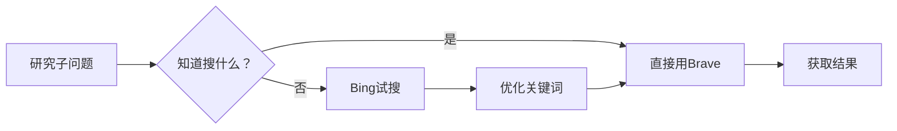

# Search Tools

定义 Deep Research 在 OpenCode 环境中的外部搜索工具矩阵、使用方案和降级策略。

## 环境限制

当前环境（OpenCode + macOS Darwin + 中国大陆网络）中：

- **Brave Search API** — ✅ 通过系统代理可用，API 返回结构化 JSON，中英文搜索质量均好。通过 `scripts/search.sh` 统一调用。
- **博查 AI Search API** — ✅ **中文主力搜索引擎**。国内原生 AI 搜索 API，无需代理，中文搜索质量业界最佳。详见 [references/search-backends/bocha.md](references/search-backends/bocha.md)。
- **Bing CN** — ✅ 替代方案。`webfetch(markdown)` 可用，英文搜索质量好，但中文搜索质量极差。
- **Google** — ❌ 不可达。DNS 被污染 + 反爬双重封锁；即使通过代理，反爬仍拒绝所有自动化请求。
- **Baidu** — ❌ HTTP 可达但触发反爬验证，无法获取搜索结果。
- **DuckDuckGo / Brave Search web** — ❌ 不可达。
- **Sogou** — ❌ webfetch 报 "HTMLRewriter is not defined"。

## 搜索引擎矩阵

| 搜索引擎 | webfetch | bash curl | 中文质量 | 英文质量 | 优先级 |
|---------|:-------:|:---------:|:-------:|:-------:|:-----:|
| **博查 AI Search** | ❌ | ✅ 直连（国内服务） | ✅ 最好 | ⚠️ 可用 | **1（中文）** |
| **Exa 语义搜索** | ❌ | ✅ 直连 | ⚠️ 有限 | ✅ 最好（语义） | **1（英文）** |
| **Brave Search API** | ❌ 不支持自定义 Header | ✅ 通过代理 | ✅ 好 | ✅ 好 | **2** |
| Bing CN | ✅ markdown 格式 | ✅ | ⚠️ 很差 | ✅ 好 | 3 |
| Google | ❌ | ❌ | — | — | — |
| Baidu | ❌ | ❌ 反爬 | — | — | — |
| DuckDuckGo | ❌ | ❌ | — | — | — |
| Sogou | ❌ HTMLRewriter | ❌ | — | — | — |

## 并发搜索（--parallel）

`search.sh --parallel` 模式下，中文查询并发运行博查+Brave，英文查询并发运行 Exa+Brave。结果合并输出，任一引擎失败不影响另一引擎。

```
scripts/search.sh "人工智能 2026" --parallel  # Bocha + Brave 并发
scripts/search.sh "LLM research" --parallel   # Exa + Brave 并发
```

## Brave Search API（首选搜索方案）

### API 密钥

```
BSAy9QIBpTA4saK93z3M-21Cg9kTKrK
```

### 使用模式

Brave Search API 必须通过**系统代理 + bash curl** 调用。`webfetch` 工具不支持自定义 HTTP Header，无法直接调用 Brave API。

**推荐使用统一搜索脚本（替代手写 curl）：**

```bash
# 自动语言检测 + 路由
scripts/search.sh "查询关键词"

# 强制指定后端
scripts/search.sh "查询关键词" --backend brave --lang en --count 10

# 详细用法
scripts/search.sh --help
```

**手动调用（仅在脚本不可用时）：**

```bash
export https_proxy=http://127.0.0.1:7890
export http_proxy=http://127.0.0.1:7890

curl -s --connect-timeout 15 \
  -H "X-Subscription-Token: BSAy9QIBpTA4saK93z3M-21Cg9kTKrK" \
  "https://api.search.brave.com/res/v1/web/search?q=URL_ENCODED_QUERY&count=10"
```

### 返回结果解析

Brave API 返回结构化 JSON，需用 Python 解析提取有用信息：

```python
python3 -c "
import json,sys
data = json.load(sys.stdin)
for r in data.get('web',{}).get('results',[]):
    lang = r.get('language','?')
    title = r.get('title','')
    url = r.get('url','')
    desc = r.get('description','')[:120]
    print(f'[{lang}] {title}\\n  {url}\\n  {desc}\\n')
"
```

JSON 结构关键字段：
- `data["web"]["results"][]` — 网页搜索结果（主要使用）
  - `.title` — 标题
  - `.url` — URL
  - `.description` — 描述/摘要
  - `.language` — 语言（"zh" / "en" 等）
  - `.profile.name` — 来源站点名称
  - `.extra_snippets[]` — 额外摘要片段（可获取更多页面内容，无需单独抓取）
- `data["videos"]["results"][]` — 视频结果（可作补充）
- `data["query"]["is_navigational"]` — 是否导航式查询
- `data["query"]["more_results_available"]` — 是否有更多结果

### 搜索参数

| 参数 | 说明 | 示例 |
|------|------|------|
| `q` | 搜索关键词（URL 编码） | `q=smart+parking+China` |
| `count` | 结果数量（1-20，默认 10） | `count=10` |
| `offset` | 分页偏移 | `offset=10` |
| `safesearch` | 安全搜索 | `safesearch=off` |
| `country` | 国家限定 | `country=CN` |
| `search_lang` | 搜索语言 | `search_lang=zh` |

### 频率限制

未检测到明确频率限制头（`x-ratelimit-*` 为空），但免费 API 通常为 2000次/月。**目标用量控制在 1000次/月以内**，约等于每月 50-80 次研究任务。单次研究建议控制在 5-12 次搜索内。

## 系统代理配置

本环境（macOS）检测到系统级 SOCKS/HTTP 代理，用于绕过网络封锁访问外部 API。默认代理端口 `7890`（与 `opencode-research-runner.sh` 保持一致）。

**重要行为差异：**

| 工具 | 是否走代理 | 效果 |
|------|:---------:|------|
| `webfetch` | ❌ 不走代理 | 直接连接，仅能访问国内可达站点（Bing CN / Baidu 首页 / 政府网站） |
| `bash curl` | ⚠️ 默认不走 | 需手动设置 `https_proxy=http://127.0.0.1:7890 http_proxy=http://127.0.0.1:7890 curl ...` |
| `bash curl` + 代理 | ✅ 走代理 | 可访问 Brave Search API、Bing、部分国际站点 |
| `scripts/search.sh` | ✅ 自动检测 | 自动检测代理端口并设置环境变量 |

**建议**：在 bash 会话开始时设置代理变量，避免每条命令重复：

```bash
export https_proxy=http://127.0.0.1:7890
export http_proxy=http://127.0.0.1:7890
```

## 推荐搜索方案（按优先级排列）

### Scheme A — Brave Search API（英文主力，已集成到 search.sh）

> **推荐**：使用 `scripts/search.sh "query" --backend brave` 替代手写 curl。
> 详见 [scripts/search.sh](../../scripts/search.sh)。

手动调用模板：

```bash
export https_proxy=http://127.0.0.1:7890
export http_proxy=http://127.0.0.1:7890

curl -s --connect-timeout 15 \
  -H "X-Subscription-Token: BSAy9QIBpTA4saK93z3M-21Cg9kTKrK" \
  "https://api.search.brave.com/res/v1/web/search?q=KEYWORD&count=10" | \
  python3 -c "
import json,sys
data = json.load(sys.stdin)
for r in data.get('web',{}).get('results',[]):
    print(f'[{r.get(\"language\",\"?\")}] {r.get(\"title\",\"\")}')
    print(f'  {r.get(\"url\",\"\")}')
    print(f'  {r.get(\"description\",\"\")[:150]}')
    ex = r.get('extra_snippets',[])
    if ex: print(f'  [+] 额外摘要: {ex[0][:100]}...')
    print()
"
```

- 适用于：中文关键词、英文关键词、政策法规、行业动态、技术资料、对标分析
- 限制：需通过代理 + bash curl 调用，不支持 webfetch 直接使用
- 频率：建议单次研究控制在 10-20 次搜索内

### Scheme B — Bing 通用搜索（英文 / 通用话题）

```
webfetch(format="markdown", url="https://cn.bing.com/search?q=URL_ENCODED_QUERY&cc=cn&setlang=zh-cn")
```

- 适用于：英文关键词、国际对标、技术原理、无需 API 密钥的简单场景
- 限制：中文长尾搜索词结果很差，不适用于中国政策、法规、本地行业信息

### Scheme C — 直接抓取已知权威来源（中国政策 / 法规）

当 Brave/Bing 搜索结果中识别到具体 URL 后，直接抓取完整页面：

```
# Brave 搜索结果中已包含 URL，直接 webfetch 抓取
webfetch(url="https://www.gov.cn/...")
webfetch(url="https://www.mohurd.gov.cn/...")
```

**常见中文权威来源 URL：**

| 来源 | URL 模板 | 用途 |
|------|---------|------|
| 中国政府网 | `https://www.gov.cn/search/?q=KEYWORD` | 政策、法规 |
| 住建部 | `https://www.mohurd.gov.cn/search.html?q=KEYWORD` | 城市停车政策 |
| 北大法宝 | `https://www.pkulaw.com/` + 搜索词 | 法律法规 |
| 国家统计局 | `https://www.stats.gov.cn/s?q=KEYWORD` | 统计数据 |
| 央行/银保监 | `https://www.cbirc.gov.cn/cn/view/pages/index/search.html?key=KEYWORD` | 支付/金融合规 |
| 巨潮资讯 | `http://www.cninfo.com.cn/new/fulltextSearch?keyword=KEYWORD` | 上市公司公告 |

### Scheme D — 英文搜索发现中文来源

先用英文关键词搜索（Brave API），搜索结果中的英文文章常引用中文来源：

```
q=China+smart+parking+prepaid+card+regulation+2025
```

然后从英文页面的引用中发现权威中文来源 URL，再用 webfetch 抓取。

### Scheme E — 博查 AI Search API（中文主力，新增）

> **推荐**：使用 `scripts/search.sh "中文查询"` 自动路由到博查。
> 完整文档：[references/search-backends/bocha.md](references/search-backends/bocha.md)。

博查是国内首个 AI 原生的搜索引擎 API，返回 AI 优化的长摘要（500+ 字符），中文搜索质量业界最佳。**无需代理，直连国内服务**。

**前置条件**：需注册免费 API Key（[open.bochaai.com](https://open.bochaai.com/)），设置环境变量：

```bash
export BOCHA_API_KEY="your-api-key-here"
```

**通过 search.sh 调用（推荐）**：

```bash
scripts/search.sh "智慧停车 城市治理 政策 2025"
scripts/search.sh "胖东来 郑州店 开业" --freshness oneMonth
```

**手动调用**：

```bash
curl -s --connect-timeout 15 \
  -H "Authorization: Bearer $BOCHA_API_KEY" \
  -H "Content-Type: application/json" \
  -d '{"query":"智慧停车 城市治理","count":10,"freshness":"noLimit"}' \
  "https://api.bochaai.com/v1/web-search" | \
  python3 -c "
import json,sys
data = json.load(sys.stdin)
for p in data.get('data',{}).get('pages',[]):
    print(f'[{p.get(\"language\",\"zh\")}] {p.get(\"title\",\"\")}')
    print(f'  {p.get(\"url\",\"\")}')
    print(f'  site: {p.get(\"siteName\",\"\")}  date: {p.get(\"dateLastCrawled\",\"\")[:10]}')
    print(f'  {p.get(\"summary\",\"\")[:200]}')
    print()
"
```

- 适用于：中文关键词、政策法规、行业动态、中国企业/市场信息
- 限制：需要 API Key（免费注册）；英文搜索质量不如 Brave
- 频率：免费用户通常 100-500 次/天，以控制台显示为准

### Scheme F — Exa 语义搜索 API（英文语义主力，新增）

> **推荐**：使用 `scripts/search.sh "English query"` 自动路由。
> 完整文档：[references/search-backends/exa.md](references/search-backends/exa.md)。

Exa 是基于嵌入向量的语义搜索引擎，按语义理解返回最相关结果，而非关键词匹配。特别适合：
- 学术论文搜索（`category: research paper`）
- 概念性/模糊查询（语义匹配优于关键词）
- 公司/人物信息发现（`category: company/people`）
- 深度研究（`type: deep`）

免费额度 1,000 次/月，定价 $7/千次（含内容提取）。

**通过 search.sh 调用**：

```bash
scripts/search.sh "latest LLM research" --lang en        # 自动路由（有Key时优先Exa）
scripts/search.sh "transformer optimization" --backend exa --lang en  # 强制Exa
scripts/search.sh "AI safety" --parallel --lang en       # Exa + Brave 并发
```

## search.sh 统一搜索脚本

新增 `scripts/search.sh` 统一搜索入口，替代手写 curl 命令：

```
用法：
  search.sh "查询"                           # 自动语言检测+路由
  search.sh "查询" --lang zh                 # 强制中文（走博查）
  search.sh "查询" --lang en --backend brave # 强制英文走 Brave
  search.sh "查询" --count 5 --no-cache      # 5条结果，跳过缓存
  search.sh "查询" --dry-run                 # 预览即将执行的搜索
  search.sh --help                           # 完整帮助
```

特性：
- 自动语言检测（中文→博查，英文→Exa/Brave）
- 多引擎并发（`--parallel`，博查+Brave 或 Exa+Brave 同时搜索）
- 引擎 fallback（博查失败→Brave，Exa失败→Brave，Brave失败→博查/Exa）
- 会话级缓存（MD5 键，/tmp/opencode-brave-cache.json）
- 搜索计数器集成（/tmp/opencode-brave-count）
- 指数退避重试（最多 3 次）

### Scheme F — Exa 语义搜索 API（英文语义主力，新增）

> **推荐**：使用 `scripts/search.sh "English query"` 自动路由（有 EXA_API_KEY 时优先 Exa）。
> 完整文档：[references/search-backends/exa.md](references/search-backends/exa.md)。

## Phase 2 搜索执行强制规则

### 搜索预算（用量控制）

**月度预算**：1000次 Brave API 搜索，约每月50-80次研究任务，合 5-12次/任务。

**单次研究任务搜索预算**：

| 研究类型 | 预算 | 说明 |
|---------|:----:|------|
| high_quality / business_decision | ≤15次 | 关键决策支持，需多维度搜索 |
| high_quality / government_report | ≤12次 | 政策类搜索可利用 gov.cn 直接抓取替代 |
| high_quality / technical_route | ≤10次 | 技术类可用 Bing 英文搜索替代部分需求 |
| high_quality / investment_analysis | ≤12次 | 数据密集但可用巨潮/财报直接抓取替代 |
| balanced / general_research | ≤8次 | 通用研究可先用 Bing 免费方案试搜 |
| cost_saving / draft_fast | ≤3次 | 低成本模式，优先 Bing |

**Phase 内分配**：

| Phase | 用途 | 最大预算 |
|:----:|------|:-------:|
| Phase 2 | 资料搜索（主体搜索工作） | 总预算的70% |
| Phase 3 | 事实核验与反证证据搜索 | 总预算的20% |
| Phase 5/6 | 数据补缺 | 总预算的10% |

### 用量优化策略

#### 策略1：搜前规划 — 批量设计查询词

在 Phase 1（问题拆解）结束时，一并输出所有拟搜索查询词，合并同类项后再执行：

**禁止**：想到一个搜一个，换来换去反复搜类似词。
**必须**：先列完整搜索词清单 → 去重 → 合并 → 再按优先级执行。

搜索词规划步骤：

```
1. 列出所有研究子问题需要的数据项
2. 为每个数据项设计搜索词（1个数据项1个搜索词，避免冗余）
3. 检查搜索词之间的重叠度，合并覆盖范围重叠的词
4. 为每个搜索词标注优先级（高/中/低）
5. 先执行高优先级，用掉了预算的70%后评估是否还需搜中/低优先级
6. 标记预计消耗搜索次数
```

#### 策略2：每条查询词最大化信息产出

一条设计良好的查询词应能在一次请求中覆盖多个子问题，避免分拆成多条相近查询。

**反面示例（应避免）**：
```
搜索1: China smart parking market size
搜索2: China smart parking major companies
搜索3: China smart parking revenue model
→ 3次请求，3组结果，内容大量重叠
```

**正面示例（推荐）**：
```
搜索1: China smart parking market report 2025 major companies revenue model
→ 1次请求，extra_snippets 中可能包含市场数字、公司名、商业模式描述
```

**extra_snippets 深度利用**：Brave 返回的 extra_snippets 字段包含页面核心段落，可以从中直接提取数字、观点、公司信息，通常无需再单独抓取页面。这可以节省 40-60% 的后续抓取请求。

#### 策略3：Bing 先探路，Brave 再深入

Bing（Scheme B）是免费的，没有 API 配额限制。对于不确定搜索词方向或想快速探索的情况，先用 Bing 试搜找到有效关键词，再用 Brave 精准搜索：



适用场景：
- 不确定该用什么英文术语 → Bing 中英混合试搜 → 确认术语后 Brave 精准搜
- 需要快速了解话题范围 → Bing 扫一遍标题 → 确定方向后 Brave 深度搜
- 该子问题是否已有数据 → Bing 快速检查 → 有则用 Brave 补充细节

#### 策略4：会话级缓存 — 同次研究不重复搜索

在 Phase 2 开始前创建搜索缓存文件，每次搜索前先查缓存：

```bash
# Phase 2 开始前初始化
CACHE_FILE="/tmp/opencode-brave-cache.json"
echo '{}' > "$CACHE_FILE"
```

```bash
# 每次搜索前：检查缓存
CACHE_FILE="/tmp/opencode-brave-cache.json"

search_brave() {
    local query="$1"
    local cache_key=$(echo "$query" | md5 | head -c 16)

    # 缓存命中则直接返回
    local cached=$(python3 -c "
import json
with open('$CACHE_FILE') as f:
    cache = json.load(f)
    print(cache.get('$cache_key', ''))
" 2>/dev/null)
    if [ -n "$cached" ]; then
        echo "$cached" | python3 -m json.tool 2>/dev/null && return
    fi

    # 缓存未命中：执行搜索
    result=$(export https_proxy=http://127.0.0.1:7897
    export http_proxy=http://127.0.0.1:7897
    curl -s --connect-timeout 10 \
      -H "X-Subscription-Token: BSAy9QIBpTA4saK93z3M-21Cg9kTKrK" \
      "https://api.search.brave.com/res/v1/web/search?q=${query// /+}&count=10")

    # 写入缓存
    python3 -c "
import json
with open('$CACHE_FILE') as f:
    cache = json.load(f)
cache['$cache_key'] = $result
with open('$CACHE_FILE','w') as f:
    json.dump(cache, f)
"

    echo "$result" | python3 -m json.tool
}
```

对相似查询变体（如同义词、不同语序）也应检查缓存键的相似性，避免因 URL 编码差异导致重复请求。

#### 策略5：上下文串联 — 一次搜索结果服务多个分析环节

一次 Brave 搜索返回的结果集应被多个分析环节复用：

```
搜索 "China smart parking industry report 2025"
可同时服务于：
├── 市场规模数据（extra_snippets）
├── 主要玩家列表（results[].title + description）
├── 商业模式描述（extra_snippets）
├── 政策背景引用（results[].url → webfetch）
├── 对标公司发现（results[].profile.name）
└── 数据来源发现（results[].url 引导到权威来源）
```

在 Phase 2 搜索执行时，对每条结果同时记录"可用于哪些分析环节"，避免 Phase 4 分析时再回头搜索。

#### 策略6：优先 extra_snippets，次优 webfetch

Brave 返回的 `extra_snippets` 字段包含页面核心段落文本。能用 extra_snippets 提取的数据 **不需要** 再 `webfetch` 抓取完整页面。这减少了 API 用量（节省第二步抓取）和总搜索次数（不需要重新搜索来补充细节）。

```
从 extra_snippets 可提取：
- 数值数据（市场规模、增长率、用户数）
- 关键观点（政策原文、公司声明）
- 来源引用（引用的其他报告、政府文件）
- 对比数据（A vs B 的对比描述）

只有当 extra_snippets 不足以支撑结论时，才 webfetch 抓取完整页面。
```

#### 策略7：计数器 — 实时追踪用量

每次 Phase 2 搜索时附带计数，超预算时自动告警：

```bash
# 追踪文件
COUNT_FILE="/tmp/opencode-brave-count"

# 初始化
echo "0" > "$COUNT_FILE"

# 每次搜索前检查+自增
count=$(cat "$COUNT_FILE")
if [ "$count" -ge 15 ]; then
    echo "⚠️ 警告：本次研究已用 $count 次 Brave 搜索，达到预算上限(15次)"
    echo "后续搜索仅限最关键的数据缺口，或用 Bing(免费)替代"
fi
echo $((count + 1)) > "$COUNT_FILE"
```

### 搜索执行示例（预算控制版）

```
# Phase 2 开始
1. export https_proxy=http://127.0.0.1:7890
2. echo "0" > /tmp/opencode-brave-count
3. 列出所有高优先级搜索词（≤70%预算 = ≤10次）
4. 对每个词：先查缓存 → 未命中则搜索 → 写入缓存 → 更新计数
5. 第一批搜索完成 → 评估结果覆盖度
6. 如仍有缺口：从剩余预算中分配2-3次用于补充搜索
7. 如需搜索数量超过预算 → 部分改用 Bing(免费)
```

### 搜索尝试顺序
   - **第 1 步**：Scheme E（博查）或 Scheme A（Brave）— 根据 `search.sh` 语言路由自动选择
   - **第 2 步**：如果首选搜索结果不足（<5 条相关结果），自动 fallback 到另一引擎
   - **第 3 步**：如果仍然不足，补充 Scheme D（英文发现中文来源）
   - **第 4 步**：识别结果中出现的权威来源 URL，用 Scheme C 直接抓取
   - **第 5 步**：Scheme B（Bing）作为最后兜底
   - **第 6 步**：以上全部失败，才可标记"搜索失败"，记录 source_failure_log

### 结果判断标准
   - **成功**：搜索结果中 ≥5 条与研究问题直接相关
   - **部分成功**：1-4 条相关，需补充直接抓取
   - **失败**：0 条相关，或 API 不可用

### 禁止行为
   - 不搜索直接标记"搜索失败"
   - 搜索失败后不尝试替代方案（Scheme B/C/D）
   - 看到结果摘要不理想但不抓取具体页面确认内容

### 搜索执行报告
Phase 2 执行后必须在内部记录：
   - 使用的 Scheme
   - 搜索成功/部分成功/失败 + 原因
   - 本次搜索消耗次数（计数器读数）
   - 下一步动作

## MCP 搜索协议支持

除了通过 `search.sh` 脚本直接调用搜索 API 外，Deep Research 还可以通过 **MCP（Model Context Protocol）** 接入第三方搜索服务。OpenCode 原生支持 MCP 协议，无需额外安装 SDK。

### 可接入的 MCP 搜索服务

| MCP Server | 安装方式 | 提供的能力 |
|-----------|---------|-----------|
| **exa-mcp-server** | `npx -y mcp-remote https://mcp.exa.ai/mcp` | Exa 语义搜索 + 深度研究 + 代码搜索 |
| **tavily-mcp** | `npx -y @tavily/mcp` | Tavily AI 优化搜索 + 智能内容提取 |
| **apify-mcp-server** | URL: `https://mcp.apify.com` | 2000+ 爬虫（社交媒体/地图/电商/搜索） |
| **browserbase-mcp** | `npx @browserbasehq/mcp-server-browserbase` | 浏览器自动化（JS页面/截图/表单填写） |

### 配置方式

在 OpenCode 的 MCP 配置中添加（具体路径取决于 OpenCode 版本）：

```json
{
  "mcpServers": {
    "exa": {
      "command": "npx",
      "args": ["-y", "mcp-remote", "https://mcp.exa.ai/mcp"],
      "env": { "EXA_API_KEY": "${EXA_API_KEY}" }
    },
    "tavily": {
      "command": "npx",
      "args": ["-y", "@tavily/mcp"],
      "env": { "TAVILY_API_KEY": "${TAVILY_API_KEY}" }
    }
  }
}
```

### 与传统搜索的互补

| 场景 | 推荐方式 |
|------|---------|
| 结构化研究（来源分级、预算管控） | `search.sh`（Script 方式） |
| 快速单个搜索 | `search.sh`（Script 方式） |
| 浏览器自动化/JS页面 | MCP browserbase/apify |
| 社交媒体数据抓取 | MCP apify |
| Agent 工具链集成 | MCP + Agent 框架 |

## SearXNG 自建搜索（Scheme G）

如需零 API 成本的无限搜索，可自建 SearXNG 实例。详见：
- [references/search-backends/searxng-deploy.md](references/search-backends/searxng-deploy.md)

## 搜索关键词设计规范

- 中文搜索词：拆成 2-3 个独立词（如 `parking+stored+value+card+China`）
- 英文搜索词：具体术语 + 年度（如 `parking prepaid card regulation 2025`）
- 法规搜索：加 `regulation` `law` `compliance`（如 `China prepaid card regulation`）
- 行业搜索：加 `industry` `market` `report`（如 `smart+parking+China+industry+report+2025`）
- 可用负向排除：用 `NOT`（如 `smart parking NOT hardware NOT equipment`）

## 搜索关键词模板（常用研究场景）

| 研究场景 | 英文搜索词（Brave 首选） | 中文搜索词（Bing 备用） |
|---------|------------------------|----------------------|
| 支付合规 | `China prepaid card payment regulation` | 不适用 |
| 停车行业 | `China smart parking market size 2025` | 不适用 |
| 市场对标 | `smart parking platform revenue model comparison` | 不适用 |
| 政府政策 | `China parking policy 2025 government` | 不适用 |
| 技术方案 | `edge AI parking recognition solution` | 不适用 |
